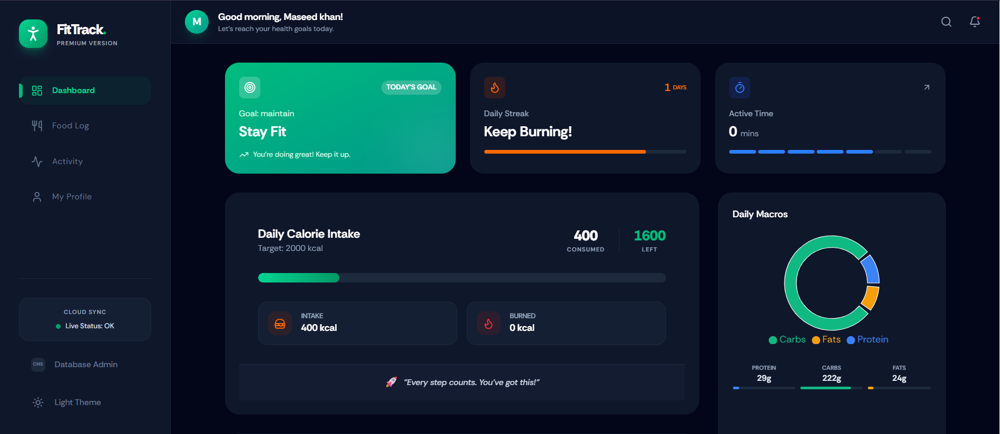

# FitTrack. — Premium AI-Powered Fitness Tracker 🏋️‍♂️✨

[](https://reactjs.org/)
[](https://strapi.io/)
[](https://tailwindcss.com/)
[](https://deepmind.google/technologies/gemini/)

FitTrack is a state-of-the-art, professional fitness tracking application built with the MERN stack (Strapi 5 & React 19). It leverages Google's Gemini AI to provide a personalized, intelligent health experience.

---

## 📸 Dashboard Preview



*Redesigned for a premium, glassmorphic user experience.*

---

## ✨ Key Features

### 🤖 1. AI Workout Assistant
Get personalized workout routines generated by Gemini AI. Simply enter your preferences (e.g., "Dumbbells only, 20 mins, focus on core") and get a professional routine instantly.

### 🍱 2. AI Food Analysis & Macro Tracking
Snap a photo of your meal! Our AI automatically identifies the food and estimates **Calories, Protein, Carbs, and Fats**. Track your macro-nutrient distribution with real-time interactive charts.

### 💧 3. Smart Hydration Tracker
Keep track of your daily water intake with an animated progress tracker and quick-add functionality.

### 🏆 4. Gamification & Streaks
Stay motivated with our **Daily Streak System**. Earn achievements and unlock badges as you stay consistent with your fitness goals.

### 🌓 5. Premium UI/UX
*   **Dynamic Dark Mode**: Seamlessly switch between light and dark themes.
*   **Responsive Design**: Fully optimized for mobile, tablet, and desktop.
*   **Live Analytics**: Weekly progress charts using Recharts.

---

## 🛠️ Tech Stack

- **Frontend**: React 19, Vite, Tailwind CSS 4, Recharts, Lucide Icons.
- **Backend**: Strapi 5 (Headless CMS), Node.js, SQLite.
- **AI Integration**: Google Gemini 1.5 Flash SDK.
- **State Management**: React Context API.

---

## 🚀 Getting Started

### 1. Prerequisites
- Node.js (v20 or higher)
- npm or yarn
- Gemini API Key (from Google AI Studio)

### 2. Backend Setup (Strapi)
```bash
cd server
npm install
# Create a .env file and add your GEMINI_API_KEY
npm run develop
```

### 3. Frontend Setup (React)
```bash
cd client
npm install
npm run dev
```

---

## 🔧 Permissions Setup

To ensure the AI and Water Tracker work correctly, enable the following in the Strapi Admin (**Settings > Roles > Authenticated**):

- **Water-log**: `find`, `findOne`, `create`
- **Workout-assistant**: `generate`
- **Food-log**: `find`, `findOne`, `create`
- **Activity-log**: `find`, `findOne`, `create`

---

## 👨‍💻 Author
Built with ❤️ by **Rizwan Ullah**

---

*Note: This project is part of a professional fitness ecosystem designed to help users achieve their health goals through data and AI.*
